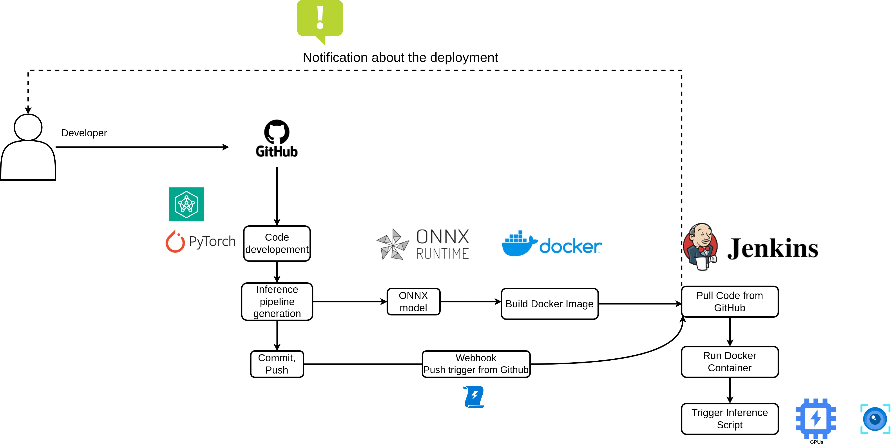

### AIops (Devlopment to Deployment) 

<!-- PROJECT SHIELDS -->
<!--
*** I'm using markdown "reference style" links for readability.
*** Reference links are enclosed in brackets [ ] instead of parentheses ( ).
*** See the bottom of this document for the declaration of the reference variables
*** for contributors-url, forks-url, etc. This is an optional, concise syntax you may use.
*** https://www.markdownguide.org/basic-syntax/#reference-style-links
-->

  
[![Contributors][contributors-shield]](https://github.com/ariharasudhanm/AIops/graphs/contributors)
[![Last-commit][last commit-shield]](https://github.com/ariharasudhanm/AIops/graphs/commit-activity)
[![LinkedIn][linkedin-shield]](https://www.linkedin.com/in/ariharasudhan/)
<!-- [![Forks][forks-shield]][forks-url] If needed add it later
[![Stargazers][stars-shield]][stars-url]  If needed add it later -->
 

  
<!-- PROJECT LOGO -->
 

  <a href="https://github.com/ariharasudhanm/Image_classification_Kaggle_Competition">
    <!--  -->
  </a>
  <h3 align="center">CI/CD Pipeline </h3>

  

    Complete pipeline from development to deployment.
     
    <a href="https://github.com/ariharasudhanm/AIops"><strong>Explore the docs »</strong></a>
     
     
    <!-- <a href="https://github.com/othneildrew/Best-README-Template">View Demo</a> -->
    ·
    <a href="https://github.com/ariharasudhanm/AIops/issues">Report Bug</a>
    ·
    <a href="https://github.com/ariharasudhanm/AIops/graphs/community">Request Feature</a>
  

<!-- MARKDOWN LINKS & IMAGES -->
<!-- https://www.markdownguide.org/basic-syntax/#reference-style-links -->
[contributors-shield]: https://img.shields.io/github/contributors/ariharasudhanm/Image-classification-using-transfer-learning?color=Green&logoColor=Red&style=for-the-badge
[contributors-url]: https://github.com/ariharasudhanm/AIops/graphs/contributors
[forks-shield]: https://img.shields.io/github/forks/othneildrew/Best-README-Template.svg?style=for-the-badge
[forks-url]: https://github.com/othneildrew/Best-README-Template/network/members
[stars-shield]: https://img.shields.io/github/stars/othneildrew/Best-README-Template.svg?style=for-the-badge
[stars-url]: https://github.com/othneildrew/Best-README-Template/stargazers
[issues-shield]: https://img.shields.io/github/issues/othneildrew/Best-README-Template.svg?style=for-the-badge
[issues-url]: https://github.com/othneildrew/Best-README-Template/issues
[license-shield]: https://img.shields.io/github/license/othneildrew/Best-README-Template.svg?style=for-the-badge
[license-url]: https://github.com/ariharasudhanm/Image_classification_Kaggle_Competition/blob/main/LICENSE
[linkedin-shield]: https://img.shields.io/badge/-LinkedIn-black.svg?style=for-the-badge&logo=linkedin&colorB=555
[linkedin-url]: https://linkedin.com/in/othneildrew
[product-screenshot]: images/screenshot.png

[Last-commit]: https://github.com/ariharasudhanm/AIops/graphs/commit-activity
[last commit-shield]: https://img.shields.io/github/last-commit/ariharasudhanm/AIops?style=for-the-badge
[matplotlib-shield]: https://img.shields.io/badge/Matplotlib-v3-Green
