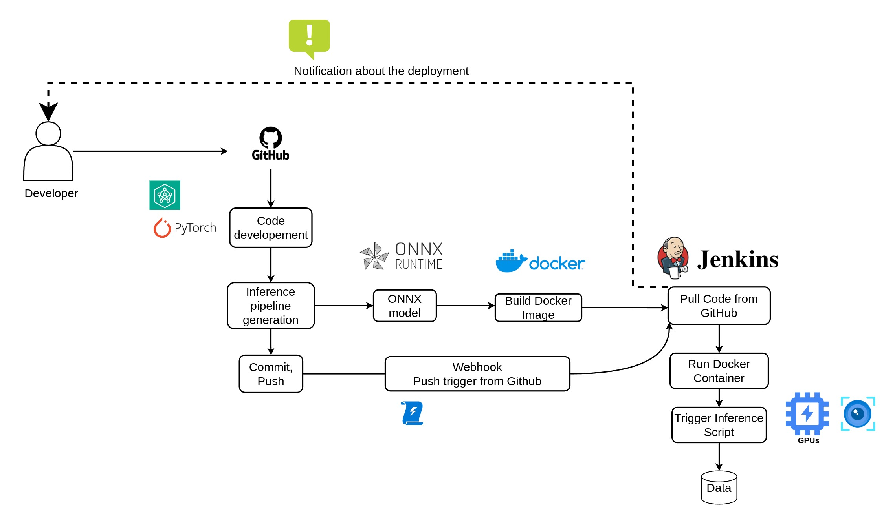

### CI/CD pipeline (Devlopment to Deployment) 

<!-- PROJECT SHIELDS -->
<!--
*** I'm using markdown "reference style" links for readability.
*** Reference links are enclosed in brackets [ ] instead of parentheses ( ).
*** See the bottom of this document for the declaration of the reference variables
*** for contributors-url, forks-url, etc. This is an optional, concise syntax you may use.
*** https://www.markdownguide.org/basic-syntax/#reference-style-links
-->

  
[![Contributors][contributors-shield]](https://github.com/ariharasudhanm/AIops/graphs/contributors)
[![Last-commit][last commit-shield]](https://github.com/ariharasudhanm/AIops/graphs/commit-activity)
[![LinkedIn][linkedin-shield]](https://www.linkedin.com/in/ariharasudhan/)
<!-- [![Forks][forks-shield]][forks-url] If needed add it later
[![Stargazers][stars-shield]][stars-url]  If needed add it later -->
 

  
<!-- PROJECT LOGO -->
 

  <a href="https://github.com/ariharasudhanm/Image_classification_Kaggle_Competition">
    <!--  -->
  </a>
  <h3 align="center">AI Inference Pipeline with Jenkins, Docker, and ONNX Runtime </h3>

  

    Complete pipeline from development to deployment.
     
    <a href="https://github.com/ariharasudhanm/AIops"><strong>Explore the docs »</strong></a>
     
     
    <!-- <a href="https://github.com/othneildrew/Best-README-Template">View Demo</a> -->
    ·
    <a href="https://github.com/ariharasudhanm/AIops/issues">Report Bug</a>
    ·
    <a href="https://github.com/ariharasudhanm/AIops/graphs/community">Request Feature</a>
  

# Overview
This project demonstrates a streamlined AI inference pipeline designed to
integrate deep learning model inference with CI/CD principles. 
With a robust setup involving Jenkins, Docker, and ONNX Runtime, this pipeline enables automated testing, deployment, and inference execution. Our goal is to ensure reliable, scalable, and efficient model inference in production environments.

# Core Components and Workflow 🛠️
Developer & Version Control (GitHub): Developers commit code changes and model updates to the GitHub repository.
Continuous Integration (Jenkins): Jenkins automates the workflow by triggering builds on every push to the repository. The code is pulled from GitHub, and Docker containers are spun up to ensure a consistent environment for each run.
Inference Framework (ONNX Runtime): The ONNX Runtime facilitates fast, optimized inference of the deep learning model.
Containerization (Docker): Docker encapsulates the entire inference pipeline, including dependencies and GPU acceleration, ensuring a consistent environment across different systems.
Notifications & Feedback: After each deployment, Jenkins provides feedback and notifications about the deployment status.

# How the Pipeline Works ⚙️
Here's a high-level breakdown of the pipeline's functionality:

Step 1: GitHub Trigger

- A webhook in GitHub triggers Jenkins whenever code is pushed to the repository.
This initiates the pipeline, pulling the latest changes from the GitHub repository.

Step 2: Docker Image Build

- Jenkins builds a Docker image that encapsulates all dependencies, including ONNX Runtime and other necessary libraries.
The image is built using a Dockerfile, which specifies the environment setup for running the inference code.

Step 3: Model Inference Execution

- The Docker container runs the inference script using ONNX Runtime, leveraging GPU acceleration if available.
The model processes images (or other input data) and generates predictions, which are stored in an output directory.

Step 4: Notification & Feedback

- Once the inference completes, Jenkins sends feedback about the status (success/failure) of the pipeline run.
If enabled, the results or logs can also be sent via email or other integrations.

<!-- MARKDOWN LINKS & IMAGES -->
<!-- https://www.markdownguide.org/basic-syntax/#reference-style-links -->
[contributors-shield]: https://img.shields.io/github/contributors/ariharasudhanm/Image-classification-using-transfer-learning?color=Green&logoColor=Red&style=for-the-badge
[contributors-url]: https://github.com/ariharasudhanm/AIops/graphs/contributors
[forks-shield]: https://img.shields.io/github/forks/othneildrew/Best-README-Template.svg?style=for-the-badge
[forks-url]: https://github.com/othneildrew/Best-README-Template/network/members
[stars-shield]: https://img.shields.io/github/stars/othneildrew/Best-README-Template.svg?style=for-the-badge
[stars-url]: https://github.com/othneildrew/Best-README-Template/stargazers
[issues-shield]: https://img.shields.io/github/issues/othneildrew/Best-README-Template.svg?style=for-the-badge
[issues-url]: https://github.com/othneildrew/Best-README-Template/issues
[license-shield]: https://img.shields.io/github/license/othneildrew/Best-README-Template.svg?style=for-the-badge
[license-url]: https://github.com/ariharasudhanm/Image_classification_Kaggle_Competition/blob/main/LICENSE
[linkedin-shield]: https://img.shields.io/badge/-LinkedIn-black.svg?style=for-the-badge&logo=linkedin&colorB=555
[linkedin-url]: https://linkedin.com/in/othneildrew
[product-screenshot]: images/screenshot.png

[Last-commit]: https://github.com/ariharasudhanm/AIops/graphs/commit-activity
[last commit-shield]: https://img.shields.io/github/last-commit/ariharasudhanm/AIops?style=for-the-badge
[matplotlib-shield]: https://img.shields.io/badge/Matplotlib-v3-Green
