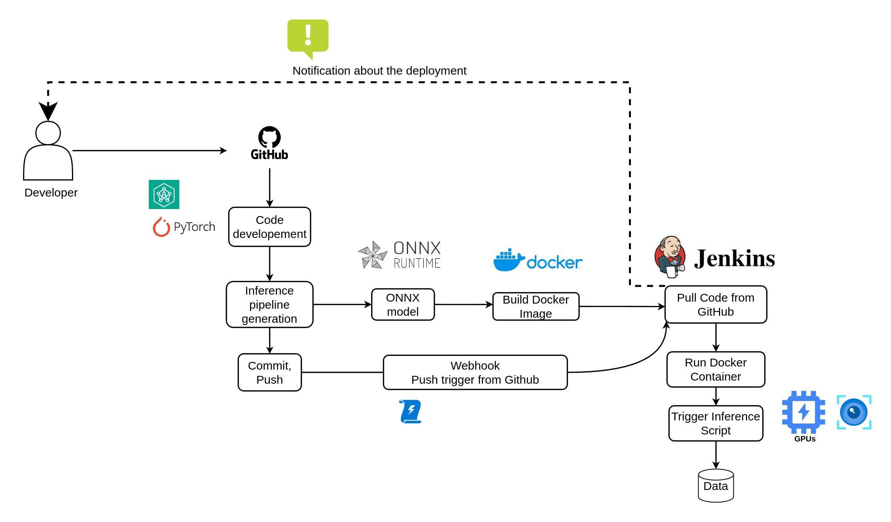

### AIops: AI Inference Pipeline with MLOps Integration 

<!-- PROJECT SHIELDS -->
<!--
*** I'm using markdown "reference style" links for readability.
*** Reference links are enclosed in brackets [ ] instead of parentheses ( ).
*** See the bottom of this document for the declaration of the reference variables
*** for contributors-url, forks-url, etc. This is an optional, concise syntax you may use.
*** https://www.markdownguide.org/basic-syntax/#reference-style-links
-->

<div align="center">
  
[![Contributors][contributors-shield]](https://github.com/ariharasudhanm/AIops/graphs/contributors)
[![Last-commit][last commit-shield]](https://github.com/ariharasudhanm/AIops/graphs/commit-activity)
[![LinkedIn][linkedin-shield]](https://www.linkedin.com/in/ariharasudhan/)
<!-- [![Forks][forks-shield]][forks-url] If needed add it later
[![Stargazers][stars-shield]][stars-url]  If needed add it later -->
 </p>
</div>


  
<!-- PROJECT LOGO -->
<br />
<div align="center">
  <a href="https://github.com/ariharasudhanm/Image_classification_Kaggle_Competition">
    <!--  -->
  </a>
  <h3 align="center">AI Inference Pipeline with Jenkins, Docker, and ONNX Runtime </h3>

  <p align="center">
    Complete pipeline from development to deployment.
    <br />
    <a href="https://github.com/ariharasudhanm/AIops"><strong>Explore the docs »</strong></a>
    <br />
    <br />
    <!-- <a href="https://github.com/othneildrew/Best-README-Template">View Demo</a> -->
    ·
    <a href="https://github.com/ariharasudhanm/AIops/issues">Report Bug</a>
    ·
    <a href="https://github.com/ariharasudhanm/AIops/graphs/community">Request Feature</a>
  </p>
</div>




# Overview

This repository demonstrates the **core work of implementing MLOps (Machine Learning Operations)** for AI model deployment and inference. It showcases a complete end-to-end pipeline that bridges the gap between AI model development and production deployment.

## 🎯 Core Work & Purpose

**Primary Focus**: Building a production-ready AI inference pipeline that integrates:
- **Computer Vision AI Models** (YOLOv4/YOLOv8 for object detection)
- **Automated CI/CD workflows** for continuous integration and deployment  
- **Containerized deployment** with GPU acceleration support
- **MLOps best practices** for reliable, scalable AI model serving

**Key Value Proposition**: Transform AI model prototypes into production-ready systems through automation, containerization, and robust DevOps practices.

## 🚀 What This Repository Demonstrates

1. **AI Model Integration**: Real-world object detection using COCO-trained models (80 object classes)
2. **MLOps Pipeline**: Automated model deployment from code commit to inference execution
3. **Production Readiness**: Docker containerization with NVIDIA GPU support
4. **CI/CD Automation**: Jenkins-based pipeline with GitHub webhook integration
5. **Optimized Inference**: ONNX Runtime for cross-platform, high-performance model execution


# Core Components and Workflow 🛠️

## Technical Architecture

### 🧠 AI/ML Components
- **YOLOv4 Model**: Primary object detection model in ONNX format
- **YOLOv8 Integration**: Alternative model for comparison and testing  
- **ONNX Runtime**: Cross-platform inference engine with GPU acceleration
- **COCO Dataset**: 80 object classes for comprehensive detection capabilities

### 🔄 MLOps Pipeline Components  
- **Version Control (GitHub)**: Source code management with webhook triggers
- **Continuous Integration (Jenkins)**: Automated build, test, and deployment
- **Containerization (Docker)**: Consistent environment with NVIDIA CUDA support
- **GPU Acceleration**: NVIDIA container runtime for high-performance inference

### 📊 Data Flow
```
Code Push → GitHub Webhook → Jenkins Pipeline → Docker Build → 
GPU-Accelerated Inference → Results Output → Status Notification
```


# How the Pipeline Works ⚙️

## Step-by-Step Workflow

### Step 1: Development & Version Control
- Developers commit AI model updates, inference code, or configuration changes
- GitHub webhook automatically triggers the Jenkins pipeline on every push
- Version control ensures reproducible deployments and rollback capabilities

### Step 2: Automated CI/CD Pipeline  
- **Jenkins pulls latest code** from GitHub repository
- **Docker image building** with all dependencies (Python, OpenCV, ONNX Runtime, CUDA)
- **Environment consistency** across development, testing, and production
- **GPU runtime configuration** for accelerated inference

### Step 3: AI Model Inference Execution
- **Container deployment** with NVIDIA GPU access
- **YOLOv4 model loading** through ONNX Runtime
- **Image processing pipeline**: preprocessing → inference → postprocessing  
- **Object detection results** with bounding boxes and confidence scores
- **Output generation** saved to designated directory

### Step 4: Results & Monitoring
- **Success/failure notifications** through Jenkins
- **Inference results** automatically saved as annotated images
- **Pipeline status reporting** for continuous monitoring
- **Log aggregation** for debugging and performance analysis

## 🔧 Technical Specifications

### AI Model Details
- **Model Type**: YOLOv4 Object Detection
- **Format**: ONNX (Open Neural Network Exchange)  
- **Input**: 416x416 RGB images
- **Output**: Bounding boxes, class predictions, confidence scores
- **Classes**: 80 COCO dataset categories (person, car, bicycle, etc.)

### Infrastructure Requirements  
- **Base Image**: NVIDIA CUDA 12.6.2 with cuDNN runtime
- **Python**: 3.x with OpenCV, NumPy, SciPy, Matplotlib
- **GPU Support**: NVIDIA Docker runtime for acceleration
- **Storage**: Persistent volumes for model weights and outputs


## 🚀 Getting Started

### Prerequisites
- Docker with NVIDIA container runtime
- Python 3.x
- CUDA-compatible GPU (optional, falls back to CPU)
- Jenkins (for CI/CD pipeline)

### Quick Start - Local Inference

1. **Clone the repository**
```bash
git clone https://github.com/ariharasudhanm/AIops.git
cd AIops
```

2. **Install dependencies**  
```bash
pip install -r requirements.txt
pip install onnxruntime  # or onnxruntime-gpu for GPU acceleration
```

3. **Run object detection inference**
```bash
python inference_yolov4.py
```

4. **View results**
- Check `prediction.jpg` for annotated detection results
- Console output shows detected objects and confidence scores

### Docker Deployment

1. **Build the Docker image**
```bash
docker build -t yolov4_inference_image .
```

2. **Run inference in container**
```bash
# CPU-only inference
docker run -v $(pwd)/output:/app/output yolov4_inference_image

# GPU-accelerated inference (requires NVIDIA Docker)
docker run --gpus all -v $(pwd)/output:/app/output yolov4_inference_image
```

### CI/CD Pipeline Setup

1. **Configure Jenkins webhook** pointing to your GitHub repository
2. **Set up Docker and NVIDIA runtime** on Jenkins agent
3. **Pipeline auto-triggers** on every code push
4. **Monitor results** through Jenkins dashboard

## 📁 Repository Structure

```
AIops/
├── inference_yolov4.py      # Main YOLOv4 inference script
├── inference_yolov8.py      # YOLOv8 alternative implementation  
├── requirements.txt         # Python dependencies
├── Dockerfile              # Container configuration with CUDA
├── Jenkinsfile            # CI/CD pipeline definition
├── yolov4/               # Model files and test data
│   ├── yolov4.onnx      # Pre-trained ONNX model
│   ├── coco.names       # Object class labels  
│   ├── yolov4_anchors.txt # Model anchor configurations
│   └── test_data_set_0/  # Sample test images
└── README.md             # Project documentation
```

## 💡 Use Cases

### Production Applications
- **Real-time object detection** in security systems
- **Automated quality control** in manufacturing  
- **Content moderation** for social media platforms
- **Autonomous vehicle perception** systems

### Development & Learning
- **MLOps best practices** demonstration
- **CI/CD for machine learning** workflows
- **Docker containerization** for AI models
- **GPU acceleration** optimization techniques


<!-- MARKDOWN LINKS & IMAGES -->
<!-- https://www.markdownguide.org/basic-syntax/#reference-style-links -->
[contributors-shield]: https://img.shields.io/github/contributors/ariharasudhanm/Image-classification-using-transfer-learning?color=Green&logoColor=Red&style=for-the-badge
[contributors-url]: https://github.com/ariharasudhanm/AIops/graphs/contributors
[forks-shield]: https://img.shields.io/github/forks/othneildrew/Best-README-Template.svg?style=for-the-badge
[forks-url]: https://github.com/othneildrew/Best-README-Template/network/members
[stars-shield]: https://img.shields.io/github/stars/othneildrew/Best-README-Template.svg?style=for-the-badge
[stars-url]: https://github.com/othneildrew/Best-README-Template/stargazers
[issues-shield]: https://img.shields.io/github/issues/othneildrew/Best-README-Template.svg?style=for-the-badge
[issues-url]: https://github.com/othneildrew/Best-README-Template/issues
[license-shield]: https://img.shields.io/github/license/othneildrew/Best-README-Template.svg?style=for-the-badge
[license-url]: https://github.com/ariharasudhanm/Image_classification_Kaggle_Competition/blob/main/LICENSE
[linkedin-shield]: https://img.shields.io/badge/-LinkedIn-black.svg?style=for-the-badge&logo=linkedin&colorB=555
[linkedin-url]: https://linkedin.com/in/othneildrew
[product-screenshot]: images/screenshot.png

[Last-commit]: https://github.com/ariharasudhanm/AIops/graphs/commit-activity
[last commit-shield]: https://img.shields.io/github/last-commit/ariharasudhanm/AIops?style=for-the-badge
[matplotlib-shield]: https://img.shields.io/badge/Matplotlib-v3-Green
